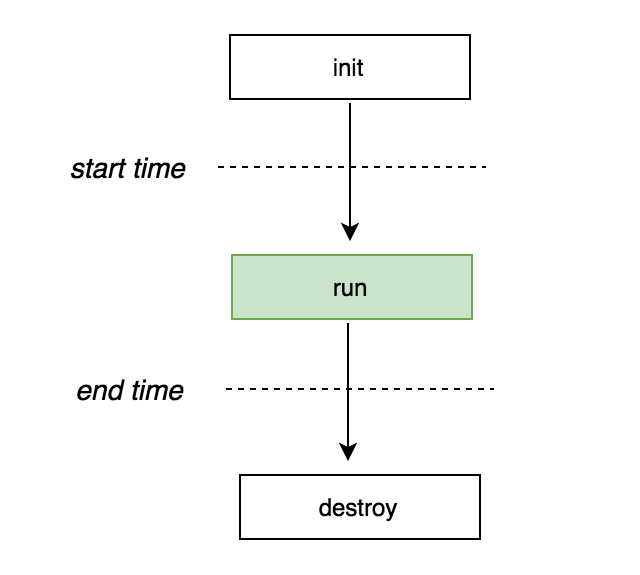

# gab
a simple **Stress Testing** tool in Golang.

# Description
## Background
According to the definition, [Stress testing](https://en.wikipedia.org/wiki/Stress_testing) is a form of deliberately intense or thorough testing used to determine the stability of a given system or entity. It involves testing beyond normal operational capacity, often to a breaking point, in order to observe the results. It may mix up with other [testing types](https://en.wikipedia.org/wiki/Software_performance_testing#Testing_types)(e.g., Load Testing, Performance Testing). [This blog](https://www.guru99.com/performance-vs-load-vs-stress-testing.html) has discussed the main differences between them.

## Referred works
In this repo, we implement a simple stress testing tool called `gab`. It mainly refers [rakyll/hey](https://github.com/rakyll/hey), which is an HTTP load generator, ApacheBench (ab) replacement, implemented in Golang.

## Our work
Our implementation mainly optimizes the concurrency pattern used in [rakyll/hey](https://github.com/rakyll/hey). In [rakyll/hey](https://github.com/rakyll/hey/blob/01803349acd49d756dafa2cb6ac5b5bfc141fc3b/requester/requester.go#L246), it dispatches the amount of work equals to `N/C` to `C` workers. This makes it less flexibility in the case of `b.N % b.C != 0`. Instead, we introduce the producer/consumer pattern to conquer this shortage.
By doing this, we also optimize the pipeline of the original WorkerPool pattern in [rakyll/hey](https://github.com/rakyll/hey).

## Details
### Framework
A typical stress measurement process is shown below:


In order to ensure sufficient stress on the service, multi-threaded concurrent access is usually used in the run procedure. And the start time and end time of each request are recorded, and the simple subtraction between the two times can be obtained.

For each request in HTTP, the procedure is like how the `traceroute` command works. It includes ICMP in the network layer, TCP in the transport layer and HTTP in the application layer.

### Optimization
The code is implemented in Go v1.12.4.
In Golang, there is a complete implementation of the needed contents in this procedure. It includes:

- [runtime](https://golang.org/pkg/runtime/): contains operations that interact with Go's runtime system, such as functions to control goroutines.
- [net/http/httptrace](https://golang.org/pkg/net/http/httptrace/): provides mechanisms to trace the events within HTTP client requests.
- [net/http](https://golang.org/pkg/net/http/): provides HTTP client and server implementations.
- [net/url](https://golang.org/pkg/net/url/): parses URLs and implements query escaping.
- [flag](https://golang.org/pkg/flag/): implements command-line flag parsing.
- [net/http/httptest/](https://golang.org/pkg/net/http/httptest/): provides utilities for HTTP testing.

```go
// Run defines the pipeline of the pool
func (p *WorkerPool) Run() {
    // start
    s := getNow()
    // running
    // allocate jobs & gathering results
    go p.AllocateJobs()
    go p.GatherResults()
    // worker
    var wg sync.WaitGroup
    for i := 0; i < p.numOfWorkers; i++ {
        wg.Add(1)
        go p.Worker(&wg)
    }
    wg.Wait()
    close(p.results)
    // end
    <-p.done
    e := getNow()
    p.timeUsed = e - s
}
```

### Comparision
- [ ] [2019-06-13]: Needed to do be done.
    - [ ] [2019-06-13]: Max size of the buffer of result channel.
    - [ ] [2019-06-13]: Performance comparision.

## Usage
```sh
-cpus Number of used cpu cores to perform.
-n Total number of requests to perform.
-c Concurrent number of multiple requests to make at a time.
```

# Conclusions
- Figure out what are the main differences between the three testing types in [this blog](https://www.guru99.com/performance-vs-load-vs-stress-testing.html).
- The pipeline of stress testing is illustrated in the [Framework](#framework) section.
- A WorkerPool pattern is introduced in the Run procedure.

# Further Reading
- [Related resources](https://www.one-tab.com/page/PVPd6fUyTcGjUhy0Fhmldg)
